

**No hay lista de skills acá. Se juega.**

[**JUGAR LA VERSIÓN INTERACTIVA**](https://josepasini.github.io/JosePasini/?lang=es) &nbsp;&nbsp;·&nbsp;&nbsp; [Leer en inglés](README.md) &nbsp;&nbsp;·&nbsp;&nbsp; [El perfil aburrido](#cv)

Sos yo, en 2020, en Mendoza. Hay un título por terminar, un trabajo por conseguir y un océano en el medio. Cada capítulo desbloquea un proyecto real, con código que podés leer.

<b>CAPÍTULOS</b> &nbsp;&mdash;&nbsp; <a href="#mendoza">1. Mendoza, 2020</a> &nbsp;·&nbsp; <a href="#utn">2. La UTN</a> &nbsp;·&nbsp; <a href="#challenge">3. El challenge</a> &nbsp;·&nbsp; <a href="#escala">4. Escala</a> &nbsp;·&nbsp; <a href="#avion">5. El avión</a> &nbsp;·&nbsp; <a href="#idioma">6. El idioma</a> &nbsp;·&nbsp; <a href="#hoy">8. Hoy</a>

---

### CAPÍTULO 1 &nbsp;·&nbsp; Mendoza, 2020
*cuarenta grados y veintitrés pestañas abiertas*

<a></a>

Cuarenta grados afuera. Adentro, un ventilador que hace más ruido que aire.

Acabás de entender qué es un puntero. No del todo, pero lo suficiente para sospechar que esto te va a gustar más de lo razonable.

Sobre el escritorio hay tres cosas: el plan de estudios, un mail sin abrir de una empresa grande, y una guitarra apoyada contra la pared.

#### Agarrar la guitarra
*easter egg*

<a></a>

Toco guitarra y piano, y las dos me enseñaron algo que se aplica directo a escribir software: **el silencio también es parte**. Una nota que no está puede sostener una frase mejor que tres notas de más. El código funciona igual: lo que decidís no escribir suele importar más que lo que si.

También voy bastante al teatro, y sostengo que un bar es un lugar excelente para pensar un problema difícil. La cantidad de veces que resolví algo lejos del teclado no es anécdota, es método.

---

### CAPÍTULO 2 &nbsp;·&nbsp; La UTN
*trabajos prácticos, y dos que se salieron del molde*

<a></a>

Spring, JPA, Hibernate Envers, auditoría de tablas, JUnit, Mockito, Sequelize, Node, React, Vue.

La mayoría de esos repos siguen ahí y son exactamente lo que dicen ser: trabajos prácticos. No los voy a vender como productos.

Pero dos dejaron de ser "entregá esto el martes" y pasaron a ser "quiero ver si puedo hacerlo bien".

#### El Buen Sabor
*el que quise hacer bien*

<a></a>

El backend de una app gastronómica en **Go**. Pedidos, login, catálogo.

La consigna no pedía nada de esto. Podía meter las queries adentro de los handlers, entregarlo y listo. En vez de eso lo usé de excusa para aprender separación de capas en serio.

El dominio no sabe que MySQL existe. Los controllers no saben que pasa abajo. Un contenedor de dependencias ensambla todo al arrancar.

**La prueba de que la separación es real:** cambiar de motor de base de datos significaría tocar `storage/` y nada más. Ni un archivo de dominio, ni un controller.

`Go` &nbsp;·&nbsp; `MySQL` &nbsp;&nbsp;|&nbsp;&nbsp; **[Abrir el código &rarr;](https://github.com/JosePasini/el-buen-sabor)**

#### La Tripulación
*el que era un juego*

<a></a>

Proyecto final de **Metodología de la Investigación**, en **Python**. Un juego de mesa jugable, con reglas, turnos y estados.

Lo interesante no fue el código sino la materia. Metodología te obliga a justificar cada decisión con algo más que "me pareció mejor así". Tuve que documentar por qué el juego estaba diseñado como estaba, qué hipótesis probaba y si los resultados la sostenían.

Es la primera vez que escribí software donde la pregunta no era "¿funciona?" sino "¿cómo sé que funciona?". Eso me quedó.

`Python` &nbsp;&nbsp;|&nbsp;&nbsp; **[Abrir el código &rarr;](https://github.com/JosePasini/LaTripulacion)**

---

### CAPÍTULO 3 &nbsp;·&nbsp; El challenge
*el mail que seguía sin abrir*

<a></a>

Abrís el adjunto. Es una API REST, pero con esa ambigüedad deliberada de los challenges buenos: la mitad de las decisiones son tuyas, y ahí es donde te miran.

Los challenges técnicos son la forma más honesta de mostrar cómo trabaja alguien. Mismo enunciado para todos, una semana, y las decisiones quedan escritas.

Uno de esos mails termina en una oferta.

| Challenge | Qué era | Stack |
| --- | --- | --- |
| [**Alkemy**](https://github.com/JosePasini/Alkemy) | API REST completa | Java / Spring Boot |
| [**Mercado Libre**](https://github.com/JosePasini/Challenge_meli) | API REST | Java |
| [**Beeline**](https://github.com/JosePasini/ju-coding-challenge) | Coding challenge | HTML / JS |

---

### CAPÍTULO 4 &nbsp;·&nbsp; Escala
*un dashboard en rojo a las 3 AM*

<a></a>

Mercado Libre. **Java**, **Go**, colas, cachés, servicios que se hablan entre si, y un tablero que a veces se pone rojo a las tres de la mañana.

Acá aprendí lo que no se enseña en la facultad: cuando hay millones de personas del otro lado, las decisiones de diseño dejan de ser teóricas. Una query sin índice no es "un poco más lenta", es un incidente. Un timeout mal configurado no es un detalle, es una cascada.

También aprendí a usar **Kibana** y **Datadog** de verdad. La diferencia entre "el sistema anda" y "puedo demostrar que el sistema anda" es la observabilidad, y es lo que te salva a las tres de la mañana.

---

### CAPÍTULO 5 &nbsp;·&nbsp; El avión
*once mil kilómetros*

<a></a>

Doce grados y llueve de costado. Mendoza queda a once mil kilómetros.

Nadie te avisa que mudarte de país te convierte otra vez en principiante: no de programación, de todo lo demás. No sabés cómo funciona el transporte, ni dónde se compra nada, ni a quién se le pide una mano.

Ese último detalle se te queda pegado. Porque resulta que mucha gente en esta ciudad necesita una mano con algo, y mucha otra quiere laburar unas horas, y las dos están mirando pantallas distintas sin encontrarse.

Tomás nota. Eso va a ser un proyecto.

---

### CAPÍTULO 6 &nbsp;·&nbsp; El idioma
*sorry, one more time?*

<a></a>

Podés tener el inglés técnico resuelto y descubrir que eso no te alcanza para entender a alguien de Cork hablando rápido en un bar.

Es la parte del cambio que menos se cuenta: escribir código nunca fue el problema, el problema era pedir el café. Y sigue en progreso, probablemente para siempre, y me parece bien que sea así.

Aprender un idioma de grande te devuelve algo útil: la sensación de ser malo en algo y seguir igual. Es exactamente la misma tolerancia que necesitás cuando te sentás frente a una tecnología que no conocés.

---

### CAPÍTULO 8 &nbsp;·&nbsp; Hoy
*donde estoy ahora*

<a></a>

Escribo backend en **Levry**, desde Dublín.

En 2026 me recibí de la **Licenciatura en Ciencia de Datos** en la **Universidad del Gran Rosario**. Volver a ser el que no entiende nada es el estado en el que aprendo mejor. Después de un rato de ser el que sabe, se extraña.

Esa es la combinación que me interesa: sistemas que aguanten de verdad, y las herramientas para entender qué están haciendo los datos que pasan por ellos.

---

<a></a>

**Llegaste hasta el final, así que probablemente quieras hablar.**

&nbsp;

&nbsp;

[**JUGAR LA VERSIÓN INTERACTIVA**](https://josepasini.github.io/JosePasini/?lang=es)

---

### El perfil aburrido

Backend engineer en **Levry**, Dublín. Antes, **Mercado Libre**. **Licenciatura en Ciencia de Datos**, Universidad del Gran Rosario (2026).

- **Backend** &nbsp; Java, Go, Spring Boot, Python, Node.js
- **Datos** &nbsp; PostgreSQL, MySQL, MongoDB, BigQuery, SQLite
- **Frontend** &nbsp; TypeScript, React, Next.js, Vue
- **Infra** &nbsp; Docker, GraphQL, Vercel, Jenkins
- **Observabilidad** &nbsp; Datadog, Kibana, Grafana
