**No hay lista de skills acá. Se juega.**

[**JUGAR LA VERSIÓN INTERACTIVA**](https://josepasini.github.io/JosePasini/?lang=es) &nbsp;&nbsp;·&nbsp;&nbsp; [Leer en inglés](README.md) &nbsp;&nbsp;·&nbsp;&nbsp; [El perfil aburrido](#cv)

Sos yo, en 2020, en Mendoza. Hay un título por terminar, un trabajo por conseguir y un océano en el medio. Cada capítulo desbloquea un proyecto real, con código que podés leer.

<b>CAPÍTULOS</b> &nbsp;&mdash;&nbsp; <a href="https://josepasini.github.io/JosePasini/?lang=es#ch=mendoza">1. Mendoza, 2020</a> &nbsp;·&nbsp; <a href="https://josepasini.github.io/JosePasini/?lang=es#ch=utn">2. La UTN</a> &nbsp;·&nbsp; <a href="https://josepasini.github.io/JosePasini/?lang=es#ch=challenge">3. El challenge</a> &nbsp;·&nbsp; <a href="https://josepasini.github.io/JosePasini/?lang=es#ch=escala">4. Escala</a> &nbsp;·&nbsp; <a href="https://josepasini.github.io/JosePasini/?lang=es#ch=avion">5. El avión</a> &nbsp;·&nbsp; <a href="https://josepasini.github.io/JosePasini/?lang=es#ch=idioma">6. El idioma</a> &nbsp;·&nbsp; <a href="https://josepasini.github.io/JosePasini/?lang=es#ch=hoy">8. Hoy</a>

---

&nbsp;

&nbsp;

---

### El perfil aburrido

Backend engineer en **Levry**, Dublín. Antes, **Mercado Libre**. **Licenciatura en Ciencia de Datos**, Universidad del Gran Rosario (2026).

- **Backend** &nbsp; Java, Go, Spring Boot, Python, Node.js
- **Datos** &nbsp; PostgreSQL, MySQL, MongoDB, BigQuery, SQLite
- **Frontend** &nbsp; TypeScript, React, Next.js, Vue
- **Infra** &nbsp; Docker, GraphQL, Vercel, Jenkins
- **Observabilidad** &nbsp; Datadog, Kibana, Grafana
