

**There is no skills list here. You play for it.**

[**PLAY THE INTERACTIVE VERSION**](https://josepasini.github.io/JosePasini/) &nbsp;&nbsp;·&nbsp;&nbsp; [Read in Spanish](README.es.md) &nbsp;&nbsp;·&nbsp;&nbsp; [The boring profile](#cv)

You are me, in 2020, in Mendoza. There is a degree to finish, a job to land and an ocean in between. Every chapter unlocks a real project, with code you can actually read.

<b>CHAPTERS</b> &nbsp;&mdash;&nbsp; <a href="#mendoza">1. Mendoza, 2020</a> &nbsp;·&nbsp; <a href="#utn">2. University</a> &nbsp;·&nbsp; <a href="#challenge">3. The challenge</a> &nbsp;·&nbsp; <a href="#escala">4. Scale</a> &nbsp;·&nbsp; <a href="#avion">5. The plane</a> &nbsp;·&nbsp; <a href="#idioma">6. The language</a> &nbsp;·&nbsp; <a href="#hoy">8. Today</a>

---

### CHAPTER 1 &nbsp;·&nbsp; Mendoza, 2020
*forty degrees and twenty three open tabs*

<a></a>

Forty degrees outside. Inside, a fan making more noise than air.

You have just understood what a pointer is. Not entirely, but enough to suspect this is going to appeal to you more than is reasonable.

There are three things on the desk: the university syllabus, an unopened email from a big company, and a guitar leaning against the wall.

#### Pick up the guitar
*easter egg*

<a></a>

I play guitar and piano, and both taught me something that applies directly to writing software: **silence is part of it too**. A note that is not there can hold a phrase better than three notes too many. Code works the same way: what you decide not to write usually matters more than what you do.

I also go to the theatre a fair bit, and I maintain that a bar is an excellent place to think through a hard problem. The number of times I solved something away from the keyboard is not an anecdote, it is a method.

---

### CHAPTER 2 &nbsp;·&nbsp; University
*coursework, and two that broke the mould*

<a></a>

Spring, JPA, Hibernate Envers, table auditing, JUnit, Mockito, Sequelize, Node, React, Vue.

Most of those repos are still there and they are exactly what they say they are: coursework. I am not going to sell them as products.

But two stopped being "hand this in on Tuesday" and became "I want to see if I can do this properly".

#### El Buen Sabor
*the one I wanted to get right*

<a></a>

The backend of a food ordering app in **Go**. Orders, login, catalogue.

The assignment asked for none of this. I could have put the queries inside the handlers, submitted it and moved on. Instead I used it as an excuse to learn layer separation properly.

The domain does not know MySQL exists. The controllers do not know what happens underneath. A dependency container wires everything at startup.

**Proof the separation is real:** switching database engine would mean touching `storage/` and nothing else. Not one domain file, not one controller.

`Go` &nbsp;·&nbsp; `MySQL` &nbsp;&nbsp;|&nbsp;&nbsp; **[Open the code &rarr;](https://github.com/JosePasini/el-buen-sabor)**

#### La Tripulación
*the one that was a game*

<a></a>

Final project for **Research Methodology**, in **Python**. A playable board game, with rules, turns and state.

The interesting part was not the code, it was the subject. Methodology forces you to justify every decision with more than "it felt better this way". I had to document why the game was designed the way it was, what hypothesis it tested, and whether the results held it up.

It is the first time I wrote software where the question was not "does it work?" but "how do I know it works?". That one stuck.

`Python` &nbsp;&nbsp;|&nbsp;&nbsp; **[Open the code &rarr;](https://github.com/JosePasini/LaTripulacion)**

---

### CHAPTER 3 &nbsp;·&nbsp; The challenge
*the email that stayed unopened*

<a></a>

You open the attachment. It is a REST API, but with that deliberate ambiguity the good challenges have: half the decisions are yours, and that is where they are looking.

Technical challenges are the most honest way to show how someone works. Same brief for everyone, one week, and the decisions stay written down.

One of those emails ends in an offer.

| Challenge | What it was | Stack |
| --- | --- | --- |
| [**Alkemy**](https://github.com/JosePasini/Alkemy) | Full REST API | Java / Spring Boot |
| [**Mercado Libre**](https://github.com/JosePasini/Challenge_meli) | REST API | Java |
| [**Beeline**](https://github.com/JosePasini/ju-coding-challenge) | Coding challenge | HTML / JS |

---

### CHAPTER 4 &nbsp;·&nbsp; Scale
*a dashboard going red at 3 AM*

<a></a>

Mercado Libre. **Java**, **Go**, queues, caches, services talking to each other, and a board that sometimes goes red at three in the morning.

This is where I learned what university does not teach: when there are millions of people on the other side, design decisions stop being theoretical. A query without an index is not "a bit slower", it is an incident. A badly configured timeout is not a detail, it is a cascade.

I also learned to use **Kibana** and **Datadog** for real. The difference between "the system works" and "I can prove the system works" is observability, and it is what saves you at three in the morning.

---

### CHAPTER 5 &nbsp;·&nbsp; The plane
*eleven thousand kilometres*

<a></a>

Twelve degrees and raining sideways. Mendoza is eleven thousand kilometres away.

Nobody warns you that moving country turns you back into a beginner: not at programming, at everything else. You do not know how the transport works, or where anything is sold, or who to ask for a hand.

That last one sticks with you. Because it turns out a lot of people in this city need a hand with something, and a lot of others want to work a few hours, and the two are staring at different screens without finding each other.

You take note. That is going to be a project.

---

### CHAPTER 6 &nbsp;·&nbsp; The language
*sorry, one more time?*

<a></a>

You can have technical English sorted and still discover it is not enough to understand someone from Cork talking fast in a pub.

It is the part of the move nobody talks about: writing code was never the problem, the problem was ordering the coffee. And it is still in progress, probably forever, and I think that is fine.

Learning a language as an adult gives you something useful back: the feeling of being bad at something and carrying on anyway. It is exactly the same tolerance you need when you sit down in front of a technology you do not know.

---

### CHAPTER 8 &nbsp;·&nbsp; Today
*where I am now*

<a></a>

I write backend at **Levry**, from Dublin.

In 2026 I graduated from **Universidad del Gran Rosario** with a **BSc in Data Science**. Going back to being the one who understands nothing is the state I learn best in. After a while of being the one who knows, you miss it.

That is the combination I care about: systems that actually hold up, and the tools to understand what the data moving through them is doing.

---

<a></a>

**You made it to the end, so odds are you want to talk.**

&nbsp;

&nbsp;

[**PLAY THE INTERACTIVE VERSION**](https://josepasini.github.io/JosePasini/)

---

### The boring profile

Backend engineer at **Levry**, Dublin. Previously **Mercado Libre**. **BSc in Data Science**, Universidad del Gran Rosario (2026).

- **Backend** &nbsp; Java, Go, Spring Boot, Python, Node.js
- **Data** &nbsp; PostgreSQL, MySQL, MongoDB, BigQuery, SQLite
- **Frontend** &nbsp; TypeScript, React, Next.js, Vue
- **Infra** &nbsp; Docker, GraphQL, Vercel, Jenkins
- **Observability** &nbsp; Datadog, Kibana, Grafana
