**There is no skills list here. You play for it.**

[**PLAY THE INTERACTIVE VERSION**](https://josepasini.github.io/JosePasini/) &nbsp;&nbsp;·&nbsp;&nbsp; [Read in Spanish](README.es.md) &nbsp;&nbsp;·&nbsp;&nbsp; [The boring profile](#cv)

You are me, in 2020, in Mendoza. There is a degree to finish, a job to land and an ocean in between. Every chapter unlocks a real project, with code you can actually read.

<b>CHAPTERS</b> &nbsp;&mdash;&nbsp; <a href="https://josepasini.github.io/JosePasini/#ch=mendoza">1. Mendoza, 2020</a> &nbsp;·&nbsp; <a href="https://josepasini.github.io/JosePasini/#ch=utn">2. University</a> &nbsp;·&nbsp; <a href="https://josepasini.github.io/JosePasini/#ch=challenge">3. The challenge</a> &nbsp;·&nbsp; <a href="https://josepasini.github.io/JosePasini/#ch=escala">4. Scale</a> &nbsp;·&nbsp; <a href="https://josepasini.github.io/JosePasini/#ch=avion">5. The plane</a> &nbsp;·&nbsp; <a href="https://josepasini.github.io/JosePasini/#ch=idioma">6. The language</a> &nbsp;·&nbsp; <a href="https://josepasini.github.io/JosePasini/#ch=hoy">8. Today</a>

---

&nbsp;

&nbsp;

---

### The boring profile

Backend engineer at **Levry**, Dublin. Previously **Mercado Libre**. **BSc in Data Science**, Universidad del Gran Rosario (2026).

| | |
| :---: | :--- |
|  |      |
|  |      |
|  |     |
|  |     |
|  |    |
